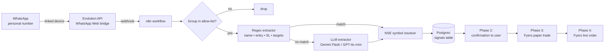

# Architecture

## High-level flow



## Components

| Component | Role | Image | Memory |
|-----------|------|-------|--------|
| Postgres 16 | Signals DB, n8n DB, Evolution DB | `postgres:16-alpine` | ~150 MB |
| Redis 7 | Evolution API cache | `redis:7-alpine` | ~50 MB |
| Evolution API | WhatsApp Web bridge (Baileys-based) | `evoapicloud/evolution-api:latest` | ~350 MB |
| n8n | Orchestration + rules + workflows | `n8nio/n8n:latest` | ~300 MB |
| **Total** | | | **~850 MB** on a 2 GB box |

## Network

- All containers on internal Docker network `stacknet`.
- Only ports **5678 (n8n)** and **8080 (Evolution)** exposed to the host.
- Postgres and Redis are **not** exposed outside Docker.

## Data flow — Phase 1

1. WhatsApp phone (linked device) → Evolution API socket.
2. Evolution stores raw message + metadata in its Postgres schema.
3. Evolution fires **webhook** to n8n on `messages.upsert`.
4. n8n workflow:
   - filters by group JID (allow-list of MSK / IITM / IPV group IDs),
   - extracts fields via regex,
   - resolves NSE symbol via lookup table,
   - inserts into `signals` table in Postgres.
5. No trading actions in Phase 1 — only observation and accuracy tuning.

## `signals` table (Phase 1)

```sql
CREATE TABLE signals (
  id              BIGSERIAL PRIMARY KEY,
  source_group    TEXT NOT NULL,           -- 'MSK' | 'IITM' | 'IPV'
  message_id      TEXT NOT NULL UNIQUE,    -- Evolution's message id, dedup key
  raw_text        TEXT NOT NULL,
  trade_type      TEXT,                    -- POSITIONAL | INTRADAY | BTST
  stock_name_raw  TEXT NOT NULL,           -- "OLA ELECTRIC"
  nse_symbol      TEXT,                    -- "OLAELEC" (nullable if unresolved)
  entry_price     NUMERIC(12,2),
  stop_loss       NUMERIC(12,2),
  targets         NUMERIC(12,2)[],         -- absolute prices (points converted)
  targets_mode    TEXT,                    -- 'absolute' | 'points_from_entry'
  extractor       TEXT NOT NULL,           -- 'regex' | 'llm'
  confidence      NUMERIC(3,2),            -- 0..1
  posted_at       TIMESTAMPTZ NOT NULL,
  created_at      TIMESTAMPTZ DEFAULT NOW()
);

CREATE INDEX idx_signals_posted ON signals(posted_at DESC);
CREATE INDEX idx_signals_symbol ON signals(nse_symbol);
```

## Later phases

- **Phase 2**: `pending_confirmations` table + WhatsApp reply handler for YES/NO.
- **Phase 3**: `paper_orders` table with what-would-have-happened logs.
- **Phase 4**: `live_orders` table linked to Fyers order IDs; kill-switch flag in a `system_flags` table.
